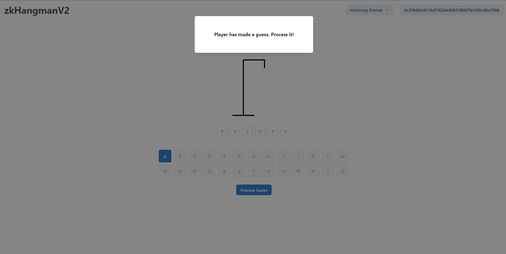

# zk-hangmanV2-frotnend
Frontend for [zk-hangmanV2](https://github.com/prajwolrg/zk-hangmanV2) and works on Harmony devnet.

## Run Locally

### Clone the repository
```bash
git clone https://github.com/prajwolrg/zk-hangmanV2-frontend.git
```

### Install the dependncies
```bash
yarn
```
### Run the Project
```bash
yarn dev
```

## Zero Knwledge Structure
The following graphic shows the structure of the zero knowledge elements used in the frotnend.
```text
├── public
│   ├── guess_0001.zkey
│   ├── guess_verification_key.json
│   ├── guess.wasm
│   ├── init_0001.zkey
│   ├── init_verification_key.json
│   ├── init.wasm
```

## Playing Game

### Creating a game
1. Connect the wallet and select the right network. 
> Currently support only for the Harmony devnet and Harmony mainnet.


2. Choose an appropriate word for the player and Click Create Game. Metamask extension must pop out. Confirm the transaction and wait for it to finalize.


### Joining the game
1. Directly copy and paste the Invitation Link and connect wallet to the right network to join the game.


### Playing the game - Player
1. Select an alphabet to guess and make a guess


2. Wait for the host to process the guess to reveal.


### Playing the game - Host
1. If the player has made a guess, the host needs to process the guess. 


### Game Win
1. If player guesses all the alphabets correctly, player wins and the host loses. Alternatively, if the player cannot guess all the alphabets, host wins and the player loses.

