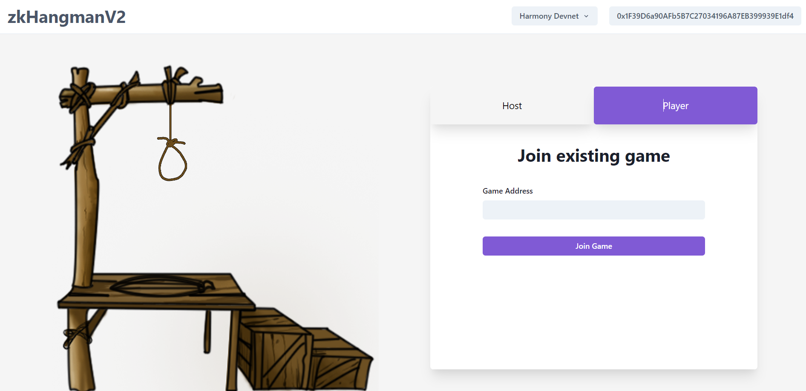

# zk-hangmanV2-frotnend
Frontend for [zk-hangmanV2](https://github.com/prajwolrg/zk-hangmanV2) and works on Harmony devnet.

## Run Locally

### Clone the repository
```bash
git clone https://github.com/prajwolrg/zk-hangmanV2-frontend.git
```

### Install the dependncies
```bash
yarn
```
### Run the Project
```bash
yarn dev
```

## Zero Knwledge Structure
The following graphic shows the structure of the zero knowledge elements used in the frotnend.
```text
├── public
│   ├── guess_0001.zkey
│   ├── guess_verification_key.json
│   ├── guess.wasm
│   ├── init_0001.zkey
│   ├── init_verification_key.json
│   ├── init.wasm
```

## Playing Game

### Creating a game
1. Connect the wallet and select the right network. 
> Currently support only for the Harmony devnet.


2. Fill the appropriate values and Click Create Game. Metamask extension must pop out. Confirm the transaction and wait for it to finalize.


### Joining the game
1. Connect the wallet and select the right network. 
2. On the Player tab, enter the game address and click Join Game.


### Playing the game - Player
1. Type your guess letter and press enter


### Playing the game - Host
1. Use the secret created during the game creation to process the guess.

